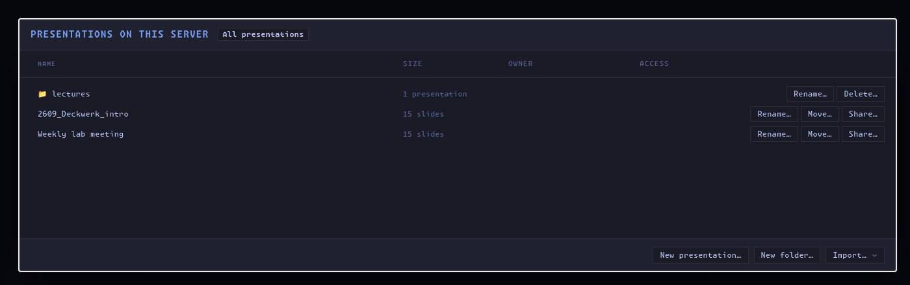

# Running a headless collaboration server

A headless DeckWerk server keeps a collection of presentations available for
collaborative editing without running the desktop editor. This is useful for a
lab workstation, a small team server, or a machine on a tailnet.

## Trust and access

Only run the server on a network you trust. The headless server does not provide
public-service security: there are no user accounts, access-control lists, or
TLS termination. Anyone who can reach it can open and edit the presentations it
exposes.

Do not expose it directly to the public internet. A private local network or a
tailnet is the intended environment.

## Prepare the presentations

Choose one folder to be the server's presentation library. Each immediate
subfolder containing a DeckWerk presentation appears in the browser.

For example:

```text
shared-decks/
  weekly-meeting/
  project-demo/
  lecture-series/
```

The server cannot read or write outside this library. People using the browser
can open its presentations, create new ones, and import presentations into it.

Do not open the same presentation in the desktop editor while the headless
server is running. During a headless session, the server must be the only
process writing that presentation folder.

## Start the server

The commands below assume a DeckWerk source checkout with its dependencies
installed.

Build the browser client once:

```bash
npm run build:collab
```

Then start DeckWerk with the path to the presentation library:

```bash
npm run collab -- /path/to/shared-decks
```

DeckWerk prints the addresses people can open. By default it listens on port
`5800` and makes itself reachable through the machine's network interfaces,
including a configured tailnet interface.

Send one of those addresses to collaborators on the same trusted network. They
open it in a browser, choose a presentation, enter their name, and begin
editing. There is nothing to install on their machines.

To choose another port:

```bash
npm run collab -- /path/to/shared-decks --port 5900
```

To make the service available only on the server machine:

```bash
npm run collab -- /path/to/shared-decks --host 127.0.0.1
```



## Local network or tailnet only

`--host` decides which network interfaces the server listens on, and so who
can reach it.

**Open on the local network.** The default (`--host 0.0.0.0`) listens on every
interface. Anyone on the same LAN can open `http://<server-ip>:5800`, and if
the machine is also on a tailnet, so can everyone on the tailnet.

**Tailnet only.** Bind to the machine's Tailscale address, and the server is
invisible to the local network:

```bash
npm run collab -- /path/to/shared-decks --host "$(tailscale ip -4)"
```

Collaborators open `http://<machine-name>:5800` (MagicDNS) or
`http://100.x.y.z:5800`.

**Tailnet only, with HTTPS and access control.** Bind to loopback and let
`tailscale serve` publish the server to the tailnet. Adding `--access` makes
each person's tailnet login their identity, so presentations can be private,
shared with named people, or view-only:

```bash
npm run collab -- /path/to/shared-decks --host 127.0.0.1 --access you@example.com
tailscale serve --bg --https=443 http://127.0.0.1:5800
```

Collaborators open `https://<machine-name>.<tailnet>.ts.net`. Never expose this
setup through `tailscale funnel`; see [docs/collab.md](../docs/collab.md) for
the details of the access model.

## What happens during a session

The server holds the authoritative version of each open presentation. It orders
incoming edits, broadcasts them to everyone, and saves changes back into the
presentation folder. Participants see one another's current slide, cursor,
selection, and edits in real time.

Anyone in the session can present or download the current presentation. Images
and videos remain ordinary files inside the presentation folder.

If a presentation or its theme is changed by another trusted tool on the server,
the session notices the change and updates connected browsers.

## Stop the server

Press **Ctrl+C** in the terminal where the server is running. DeckWerk finishes
saving open presentations before it exits.

Stopping the process disconnects collaborators, but it does not delete their
work or remove any presentations.

## Bringing your own agent

Every participant can work on a hosted presentation with the agent CLI they
already use on their own computer — Claude Code, Codex, or anything else that
runs in a terminal. Nothing runs on the server on your behalf, and each person
uses their own account.

1. Open the presentation in the browser and click **Agent…** in the toolbar.
   The panel shows one command, for example:

   ```bash
   curl -fsSL http://deck-server:5800/deckwerk-connect.mjs -o deckwerk-connect.mjs && node deckwerk-connect.mjs 'http://deck-server:5800/?deck=weekly-meeting&agent=participant-…'
   ```

2. Run it in a terminal on your machine. It needs only Node 22 or newer: the
   first half downloads the server's own bridge, the second runs it. The
   bridge mirrors the presentation folder to your computer, under
   `~/.deckwerk/mirrors/` unless you pass `--dir`, and starts your agent inside
   it — `claude` or `codex`, whichever is on your PATH, or the command you give
   with `--agent`. `--no-agent` runs only the bridge so you can start something
   else in that folder yourself.

3. Work with the agent in that terminal exactly as you would with the desktop
   editor open on the folder. It sees `deck.json`, `theme.css`, `notes.md`,
   `assets/` and the `AGENTS.md` brief, and a `./deck` command in the folder
   that takes the same commands as `slide-agent` (context, inspect, new,
   apply, validate, render, comments, asset import). Saving a file in `edit/`
   updates the shared presentation for everyone within a second or two; the
   server does the compiling, so nothing else runs on your machine. Every
   change anyone makes in the browser arrives in the mirrored folder as it
   happens, and `./deck context` reports the slides you have selected in your
   browser. Edits are attributed to your agent in History, comments are the
   task list, and the panel in your browser shows what the agent did and
   opens the scratchpad previews of what it authored.

If you would rather not run anything at all, the panel's **Copy a brief**
button gives you a prompt to paste into any agent: it points the agent at the
server's HTTP API, which is self-describing, and tags its work with your
participant id so the panel and scratchpad still follow it. The agent then
works from API responses rather than files, which is a thinner view of the
deck than the mirror gives.

Exit the agent, or press **Ctrl+C**, to disconnect. The mirrored folder stays
on your machine; running the same command again reuses it. Start the server
with `--no-local-agents` to turn the feature off.

With `--access`, a bridge is admitted under the same tailnet identity as the
browser it was started from, and nobody else can attach an agent to your
participant id.

## Optional shared agent

The headless server has an experimental shared-agent mode:

```bash
npm run collab -- /path/to/shared-decks --shared-agent
```

This gives every collaborator access to one server-owned Codex account and
conversation. It is intended for controlled demos and trusted teams, not as a
multi-user account system. Sign-in and account switching are available only
from `http://127.0.0.1:5800` on the server machine. Replace `5800` if you chose
a different port.

Without `--shared-agent`, the collaborative editor works normally and no shared
agent account is exposed; the **Agent…** button then connects each person's
own local agent as described above. The two modes do not combine: a shared
agent replaces the local-agent panel.

## Laptop-hosted sessions

For an ad hoc session around one open presentation, use **Collaborate** in the
desktop app instead. DeckWerk hosts only that presentation, copies its invite
link, and takes care of handing control between the desktop editor and the live
session. Choose **End collaboration** when everyone is finished.
